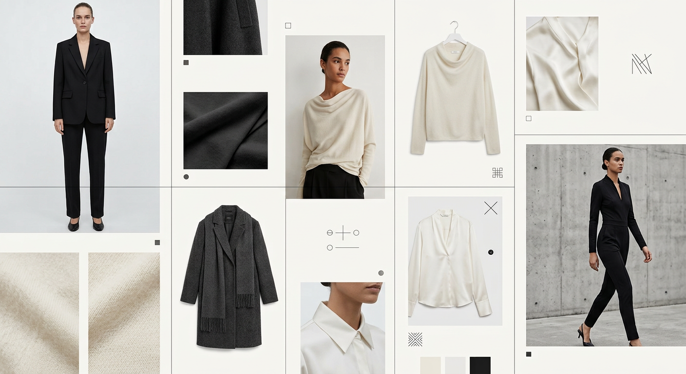
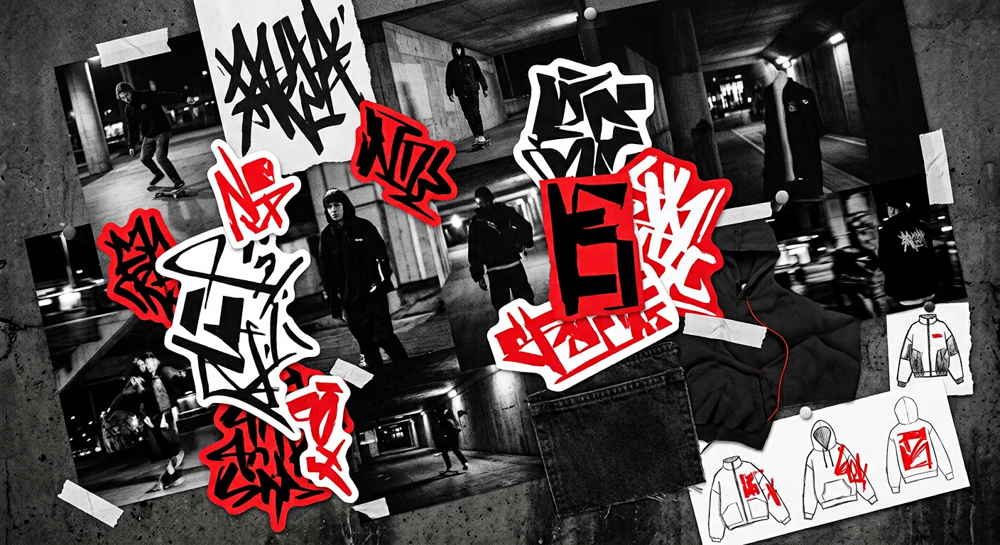
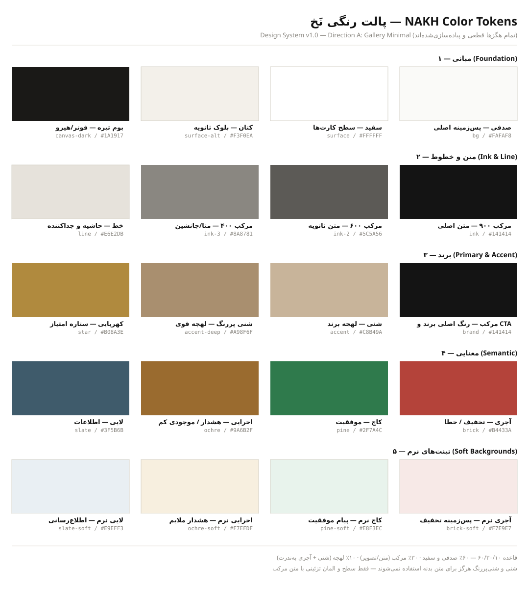

# سیستم طراحی نَخ — NAKH Design System

> **نسخه:** ۳.۰ «پالت اقیانوس» — ✅ **تأیید کارفرما (۲۰۲۶-۰۸-۲۲)** · هویت رنگی جدید: آبی اقیانوسی + سرمه‌ی عمیق + لهجه‌ی طلایی · گوشه‌های نرم Premium · فونت: ایران‌سنس · **تابع از منشور ۱۲ قانونی**  
> **وضعیت:** فاز ۰ (کشف و طراحی) — هیچ صفحه‌ای از سایت ساخته نشده است  
> **مبنا:** سند محصول `docs/product-blueprint.md` (برند پیشنهادی: نَخ / NAKH)  
> **قاعده طلایی:** هر صفحه‌ی آینده سایت فقط از همین سیستم ساخته می‌شود؛ اگر کامپوننتی در این سند نبود، اول به سیستم اضافه می‌شود، بعد استفاده.

> ⚖️ **لایه بالادستی:** همه‌ی تصمیم‌های طراحی و کد تابع [منشور ۱۲ قانونی محصول](product-laws.md) هستند (کاربر اول است، سرعت، سادگی تعامل، موبایل‌فرست، وضعیت‌های کامل و…). در تعارض، منشور برنده است.

---

## فهرست

1. [هویت برند (Brand Identity)](#۱-هویت-برند-brand-identity)
2. [سیستم رنگ (Color System)](#۲-سیستم-رنگ-color-system)
3. [سیستم تایپوگرافی (Typography)](#۳-سیستم-تایپوگرافی-typography)
4. [سیستم لایه‌بندی (Layout System)](#۴-سیستم-لایهبندی-layout-system)
5. [کتابخانه کامپوننت (Component Library)](#۵-کتابخانه-کامپوننت-component-library)
6. [کامپوننت‌های فروشگاهی (E-commerce Components)](#۶-کامپوننتهای-فروشگاهی-e-commerce-components)
7. [سیستم حرکت (Motion System)](#۷-سیستم-حرکت-motion-system)
8. [قوانین ریسپانسیو (Responsive Rules)](#۸-قوانین-ریسپانسیو-responsive-rules)
9. [دسترس‌پذیری (Accessibility)](#۹-دسترسپذیری-accessibility)
10. [پیوست الف — توکن‌ها برای پیاده‌سازی](#پیوست-الف--توکنها-برای-پیادهسازی)
11. [پیوست ب — حاکمیت و نگهداری سیستم](#پیوست-ب--حاکمیت-و-نگهداری-سیستم)

---

## ۱. هویت برند (Brand Identity)

### ۱.۱ حس و شخصیت برند

**نَخ چیست؟** آتلیه‌ای مدرن که لباس را «سلیقه» می‌فروشد نه «کالا».

سه‌ضلعی شخصیت برند:

| محور | تعریف | در محصول یعنی |
|---|---|---|
| **خوش‌سلیقه (Curated)** | هر محصول با قضاوت انتخاب شده؛ هیچ‌چیز تصادفی نیست | کاتالوگ تمیز، چیدمان ادیتوریال، بدون شلوغی بنر |
| **صداقت‌پیشه (Honest)** | قیمت، موجودی و شرایط همیشه شفاف است | قیمت خط‌خورته، موجودی واقعی سایزها، بدون هزینه پنهان |
| **صمیمیِ شیک (Warmly Chic)** | لحن دوستانه در قابی مینیمال و لوکس | میکروکپی صمیمی («این سایز تندرست!»)، فضای سفید، تایپ بزرگ |

**صفات برند (۵ کلمه):** آرام · دقیق · گرم · مطمئن · الهام‌بخش  
**ضد‌صفات (چیزی که هرگز نیست):** پرهیاهو، ارزان‌فروش، سرد و بی‌روح، شلوغ، تزئینی‌بازار

### ۱.۲ سه مسیر بصری پیشنهادی

سه موودبورد زیر با یک کاتالوگ محتوایی یکسان تصور شده‌اند؛ تفاوت فقط در «پوست» بصری است.

---

#### مسیر A — گالری مینیمال (Gallery Minimal) 🏆



- **دنیا:** گالری هنری مدرن؛ سیاه·سفید·صدفی + لهجه شنیِ محدود
- **تایپ:** بزرگ، مشکی، بی‌حاشیه؛ تیترها مثل پوستر گالری
- **تصویر:** تمام‌عرض، پرکنتراست، فضای منفی زیاد
- **مرجع حس:** Zara، COS، استودیوهای طراحی اسکاندیناوی
- **جمله توصیف‌کننده:** «یک گالری مد که صندوقه‌ی فروش مخفی و تمیزی دارد.»

#### مسیر B — آتلیه گرم (Warm Atelier)


- **دنیا:** آتلیه خیاطی با نور روز؛ بژ·شنی·کاج·کِرِم؛ بافت پارچه نمایان
- **تایپ:** متوسط‌اندازه، نرم، فاصله‌های باز
- **تصویر:** نزدیک‌بینِ جزئیات دوخت، نخ، دکمه؛ عکس‌های lifestyle گرم
- **مرجع حس:** Arket، & Other Stories، فروشگاه‌های craft
- **جمله توصیف‌کننده:** «آتلیه‌ای که دعوتت می‌کند لباس‌ها را لمس کنی.»

#### مسیر C — پالس شهری (Urban Pulse)



- **دنیا:** خیابان و شبِ شهر؛ کنتراست شدید سیاه/سفید + قرمز زنده؛ گرافیک تهاجمی
- **تایپ:** خیلی بزرگ، چرخیده، برچسب‌واره
- **تصویر:** قاب‌های کج، موشن تند، حس Drop
- **مرجع حس:** SNKRS، برندهای استریت‌ور، مگازین‌های دیجیتال جوان
- **جمله توصیف‌کننده:** «ترند قبل از اینکه ترند شود، اینجاست.»

### ۱.۳ مقایسه و انتخاب مسیر پیشنهادی

| معیار (وزن) | A گالری مینیمال | B آتلیه گرم | C پالس شهری |
|---|---|---|---|
| تناسب با مخاطب ۱۸–۴۰ سال (۳۰٪) | ⭐⭐⭐⭐⭐ | ⭐⭐⭐⭐ | ⭐⭐⭐ |
| ماندگاری و سالخوردمندی برند (۲۰٪) | ⭐⭐⭐⭐⭐ | ⭐⭐⭐⭐ | ⭐⭐ |
| اجازه‌دادن به عکس محصول برای درخشش (۲۰٪) | ⭐⭐⭐⭐⭐ | ⭐⭐⭐⭐ | ⭐⭐⭐ |
| وضوح عملکرد فروش (فیلتر/قیمت/سبد) (۲۰٪) | ⭐⭐⭐⭐⭐ | ⭐⭐⭐⭐ | ⭐⭐⭐ |
| هزینه تولید محتوا و نگهداری (۱۰٪) | ⭐⭐⭐⭐ | ⭐⭐⭐ | ⭐⭐ |
| **جمع** | **۴.۸** | **۳.۹** | **۲.۷** |

> ✅ **مسیر منتخب: A — گالری مینیمال، با «گرمای کنترل‌شده»ی مسیر B**  
> **چرا؟** ۱) مستقیم‌ترین ترجمه‌ی ترکیب «زارا + دیجی‌کالا» در سند محصول است؛ ۲) برای مخاطب ۱۸ تا ۴۰ سال به‌طور هم‌زمان «لوکس» و «قابل‌اعتماد» خوانده می‌شود؛ ۳) پالت خنثی یعنی رنگِ لباس‌ها قهرمان صفحه‌اند — دقیقاً کسب‌وکار ما؛ ۴) بی‌زمان است و برند با آن پیر نمی‌شود؛ ۵) ساده‌ترین و ارزان‌ترین مسیر برای تولید و نگهداری محتوای منسجم.  
> **گرمای B از کجا می‌آید؟** هگزهای گرم‌شده (صدفی/کتان به‌جای سفید خالص، آنتراسیت به‌جای مشکی خالص) + لهجه شنی. یعنی «زارا، اما ایرانی و مهربان‌تر».

> 🔒 **ثبت تصمیم کارفرما (۲۰۲۶-۰۸-۲۲):** مسیر **A گالری مینیمال + گرمای B** تأیید و قفل شد — این مسیر، مسیر رسمی برند است.

### ۱.۴ حس کاربر هنگام ورود به سایت (Target Emotional Response)

لحظه‌ی اول ورود (۳ ثانیه‌ی اول)، کاربر باید این جمله‌ی درونی را تجربه کند:

> «اوووم… چه نظم و آرامیش. اینجا یه برندِ جدیه. بذار ببینم چی داره.»

جدول حس هدف در پنج لحظه‌ی کلیدی:

| لحظه | حس هدف | محرک بصری |
|---|---|---|
| ورود به صفحه اصلی | آرامش + کنجکاوی + غرور مصرف‌کننده | فضای سفید، تصویر بزرگ تمیز، تایپ مطمئن، بدون بنر شلوغ |
| ورود به لیست/کاتالوگ | تسلط و کنترل («پیدا می‌کنم») | گرید منظم، فیلتر در دسترس، شمارنده نتیجه |
| ورود به صفحه محصول | تمرکز و اعتماد («همین است») | گالری بزرگ، اطلاعات ستون‌شده، قیمت شفاف |
| افزودن به سبد | رضایت و پیشرفت («کارم درست پیش می‌رود») | مینی‌کارت نرم باز می‌شود، بدون پرش صفحه |
| پرداخت | اطمینان («هیچ سوپرایزی نیست») | مراحل روشن، جمع‌صورتحساب همیشه نمایان، درگاه آشنا |

**ضد-هدف:** حس «بازارِ بنر» (اضطراب)، حس «سایت ناتمام» (بی‌اعتمادی)، حس «آلبوم عکس بدون فروشگاه» (سردرگمی).

### ۱.۵ سلف-اودیت UX — خودمان جاى کاربر زدیم

قبل از قفل‌کردن سیستم، یک‌بار کامل «کاربر شدیم»: با ذهنیت هر چهار پرسونای سند محصول، از ورود تا پرداخت را روی همین سیستم قدم زدیم و در هر لحظه پرسیدیم: **«چه چیزی این لحظه را راحت می‌کند؟»**

| لحظه | ذهن کاربر | چه چیزی راحتم می‌کند | وضعیت در سیستم |
|---|---|---|---|
| ورود به خانه | «از کجا شروع کنم؟» | یک پیام روشن + شورتکات دسته‌ها در اولین اسکرول | ✅ ساختار خانه (سند محصول §۸) |
| لیست محصولات | «اصلاً سایزم هست؟» | فیلتر سایز با شمارنده نتیجه + چیپ‌های فعال دیده‌شونده | ✅ بخش ۵.۷ و §۱۱ سند محصول |
| صفحه محصول | «نکنه سایزم را اشتباه بگیرم؟» | راهنمای سایز + فیت‌سنج + «مدل: قد ۱۷۶، سایز S» | ✅ §۹ سند محصول |
| لحظه تصمیم به خرید | «هزینه پنهانی داره؟» | هزینه ارسال از همین حالا معلوم باشد | ✅ قاعده شفافیت · 🆕 نوار پیشرفت ارسال رایگان در مینی‌کارت (۵.۹) |
| ورود با کد | «رمز یادم نمیاد!» | اصلاً رمز نداریم — فقط OTP | ✅ · 🆕 Paste + تأیید خودکار (۵.۲) |
| پرداخت | «قیمت وسط راه عوض می‌شه؟» | جمع سبدِ قفل‌شده در تمام مراحل | 🆕 قاعده جدید: فریزِ قیمت در Checkout (۶.۲) |
| بعد از کلیک پرداخت | «پرداخت انجام شد یا گیر کرد؟» | صفحه وضعیت + پیامک نتیجه | ✅ سند محصول |
| پشیمانی | «راه برگشتی هست؟» | مرجوعی خودخدمت + واگردِ حذف از سبد | ✅ دکمه «واگرد» در Toast (۷.۴) |

**سه ناخوشی که در همین بازبینی پیدا شد و در نسخه ۱.۱ رفع شد:**
1. **اضطراب هزینه ارسال** → نوار پیشرفت «تا ارسال رایگان ۴۵۰٬۰۰۰ تومان ماند» در مینی‌کارت (افزوده به ۵.۹).
2. **اصطکاک OTP** → پشتیبانی از چسباندن کد و تأیید خودکار پس از رقم ششم (افزوده به ۵.۲).
3. **ابهام زمان و قیمت لحظه خرید** → سطر «تحویل ۲–۴ روز کاری» در نوار خرید چسبان (۶.۹) + قفل قیمت در Checkout (۶.۲).

---

## ۲. سیستم رنگ (Color System)

### ۲.۱ پالت کامل توکن‌ها



**رنگ اصلی برند:** آبی اقیانوسی `#006B9F` — رنگ اعتماد، امنیت و خرید آسان؛ در sRGB روی همه نمایشگرها (LCD/IPS/OLED/AMOLED) پایدار است و هرگز نئونی نمی‌شود. **بومِ تیره برند:** سرمه‌ی عمیق `#082F49` (هدر/فوتر/بلوک Premium). **لهجه Premium:** طلایی `#C8A951` — فقط برای بج‌های ویژه و محصولات Premium؛ استفاده‌ی گسترده ⛔.

| گروه | توکن | هگز | نقش |
|---|---|---|---|
| مبانی | `bg` | `#FAF9F6` | پس‌زمینه اصلی تمام صفحات |
| | `surface` | `#FFFFFF` | سطح کارت‌ها، مودال، درِاور |
| | `surface-alt` | `#F3F7FA` | بلوک‌های ثانویه (سکشن مجله، پس‌زمینه بج، هاور) |
| | `canvas-dark` | `#082F49` | هدر، فوتر، بلوک‌های Premium و ادیتوریال تیره |
| متن | `ink` | `#102A43` | متن اصلی، تیترها |
| | `ink-2` | `#52667A` | متن ثانویه (توضیحات، لِیبل) |
| | `ink-3` | `#829AB1` | متا و جانشین (زمان، placeholder) — **نه برای اطلاعات خرید** |
| خطوط | `line` | `#D9E4EC` | حاشیه کارت، جداکننده، خط تب غیرفعال |
| | `line-strong` | `#BCCCDC` | حاشیه input در حالت عادی |
| برند | `brand` | `#006B9F` | رنگ اصلی برند = CTA اولیه، لینک مهم، عناصر تعاملی |
| | `brand-2` | `#72C6E8` | برند ثانویه — پس‌زمینه نرم، هایلایت، بخش تبلیغاتی |
| | `brand-soft` | `#EAF5FB` | تینت خیلی نرم برند (هاور ثانویه، سطح Highlight) |
| | `accent` | `#C8A951` | لهجه طلایی Premium (بج ویژه، محصول Premium) — استفاده محدود |
| | `accent-deep` | `#A98937` | طلایی قوی (حاشیه بج سردبیری) |
| | `star` | `#C8A951` | ستاره‌های امتیاز (پُر) |
| معنایی | `brick` | `#C0392B` | تخفیف قیمت **و** پیام خطا (Error) |
| | `pine` | `#2D8A68` | موفقیت (پرداخت موفق، موجودی) (Success) |
| | `ochre` | `#D9822B` | هشدار (موجودی کم، نکته مهم) (Warning) |
| | `slate` | `#247BA0` | اطلاعات خنثی (وضعیت سفارش) (Info) |
| تینت نرم | `brick-soft` | `#FAEAE7` | پس‌زمینه برچسب تخفیف / پیام خطا |
| | `pine-soft` | `#E6F4EE` | پس‌زمینه پیام موفقیت |
| | `ochre-soft` | `#FBF0E2` | پس‌زمینه هشدار ملایم |
| | `slate-soft` | `#E7F2F8` | پس‌زمینه اطلاع‌رسانی |
| حالت CTA | `brand-hover` | `#00577F` | هاور دکمه اولیه |
| | `brand-active` | `#064466` | حالت فشرده دکمه |
| | `disabled-bg` | `#D9E4EC` / متن `#829AB1` | دکمه/ورودی غیرفعال |

### ۲.۲ نقشه‌ی استفاده: رنگ برای چه کجاست؟

| نیاز | رنگ | قانون |
|---|---|---|
| **پس‌زمینه صفحه** | صدفی `#FAF9F6` | پیش‌فرض همه صفحات؛ سفید خالص ممنوع (خشک است) |
| **پس‌زمینه کارت/مودال** | سفید `#FFFFFF` | برای «برجسته‌شدن از صفحه»؛ سایه خیلی ملایم |
| **متن بدنه و تیتر** | سرمه‌ای `#102A43` | پیش‌فرض مطلق |
| **CTA اصلی** | دکمه آبی برند `#006B9F` با متن سفید | فقط یک CTA اولیه در هر نما؛ هرگز برای لینک عادی |
| **CTA ثانویه** | سفید + حاشیه ۱.۵px سرمه‌ای + هاور آبی برند | کنار CTA اصلی (مثلاً «افزودن» + «راهنمای سایز») |
| **لینک مهم / عنصر تعاملی** | آبی برند `#006B9F` | زیرخط منوی فعال، چیپ انتخاب‌شده، فوکوس input |
| **قیمت** | عادی: سرمه‌ای Bold · تخفیف‌خورده: **آبی برند** Bold | امضای پالت اقیانوس: قیمتِ دارای تخفیف تنها متن آبیِ مجاز خارج از لینک/CTA است |
| **تخفیف** | بجِ روی تصویر: آبی برند · چیپ درصد کنار قیمت: آجری `#C0392B` روی `brick-soft` | آجری تنها قرمزِ مجاز در صفحه؛ فقط کنار قیمت — هرگز دکمه، هرگز تیتر |
| **موفقیت** | سبز `#2D8A68` (متن) + `pine-soft` (سطح) | Toast، پیام پرداخت، وضعیت «تحویل شد» |
| **خطا** | آجری (متن) + `brick-soft` (سطح) | خطای فرم، خطای پرداخت؛ همیشه آیکون + متن، نه فقط رنگ |
| **هشدار** | نارنجی `#D9822B` + `ochre-soft` | «تنها ۲ عدد ماند»، نکته مرجوعی |
| **اطلاعات** | آبی اطلاع‌رسان `#247BA0` + `slate-soft` | وضعیت‌های خنثی سفارش |
| **برند ثانویه (آسمانی)** | `brand-2` و `brand-soft` به‌عنوان سطح | پس‌زمینه‌های نرم، بخش تبلیغاتی، Highlight — **متن روی آن همیشه سرمه‌ای** |
| **لهجه طلایی Premium** | `#C8A951` فقط سطح/بج | بج «پرفروش/انتخاب سردبیر»، محصولات Premium، آیکون‌های فوتر — سهمیه ≤۵٪ سطح؛ طلایی به‌عنوان رنگ متن روی روشن ⛔ (کنتراست پایین) |
| **تیره** | `canvas-dark` سرمه‌ی عمیق `#082F49` | هدر و فوتر و بلوک Premium حداکثر یکی در هر صفحه؛ متن روی آن سفید، لهجه‌ها طلایی/آسمانی |

### ۲.۳ قاعده ۶۰/۳۰/۱۰ و هماهنگی با عکس

- **۶۰٪** سطوح خنثی (صدفی/سفید/`surface-alt`) · **۳۰٪** سرمه‌ای (متن + عکس + بوم تیره) · **۱۰٪** لهجه (آبی برند + آسمانی؛ طلایی و آجری به‌ندرت).
- پالت UI خنثی-سرد و آرام است تا **رنگِ خود لباس‌ها** در تصاویر بدرخشد — آبی برند فقط در نقاط تصمیم (CTA، انتخاب، فوکوس) ظاهر می‌شود و همین، صفحه را «زنده» می‌کند بدون شلوغی.
- در هر نما حداکثر **یک** رنگ معنایی فعال باشد (اگر خطای فرم هست، بج تخفیفِ هم‌رنگ اشکال ندارد چون بافت متفاوت است؛ ولی Toast موفقیت + Toast خطا هم‌زمان = بازطراحی نمای خطا).

### ۲.۴ کنتراست — جفت‌های تأییدشده و ممنوعه

| جفت (متن روی سطح) | نسبت ≈ | حکم |
|---|---|---|
| سرمه‌ای `ink` روی صدفی | ۱۴:۱ | ✅ AAA — پیش‌فرض |
| سرمه‌ای روی تینت‌های نرم | ۱۱–۱۳:۱ | ✅ AAA |
| سفید روی `canvas-dark` | ۱۵:۱ | ✅ AAA — هدر/فوتر |
| سفید روی آبی برند `#006B9F` | ۴.۹:۱ | ✅ AA — دکمه CTA (متن ≥۱۴px وزن ۵۰۰) |
| آبی برند روی صدفی | ۴.۸:۱ | ✅ AA — لینک، آیکون تعاملی |
| `ink-2` روی صدفی | ۵.۶:۱ | ✅ AA |
| آجری روی صدفی | ۵:۱ | ✅ AA (قیمت تخفیف، خطا) |
| کاج روی صدفی | ۴.۳:۱ | ✅ AA |
| لایی `#247BA0` روی صدفی | ۴.۴:۱ | ✅ AA |
| نارنجی هشدار روی صدفی | ۲.۹:۱ | ⚠️ فقط با وزن ≥۶۰۰ و اندازه ≥۱۴px یا روی `ochre-soft` |
| سرمه‌ای روی آسمانی `brand-2` | ۹:۱ | ✅ AAA |
| سرمه‌ای روی طلایی `accent` | ۶.۵:۱ | ✅ AA — بج Premium |
| طلایی/آسمانی روی `canvas-dark` | ۷–۹:۱ | ✅ AA — لهجه‌های فوتر و هدر |
| `ink-3` روی صدفی | ۲.۹:۱ | ⚠️ فقط متا/آیکون غیرکلیدی، نه اطلاعات خرید |
| طلایی روی صدفی (متن طلایی) | ۲.۲:۱ | ⛔ ممنوع مطلق |
| سفید روی آسمانی `brand-2` | ۱.۸:۱ | ⛔ ممنوع مطلق |
| آبی برند روی سرمه‌ی تیره | ۳:۱ | ⛔ ممنوع برای متن (فقط سطح تزئینی بزرگ) |

> نکته‌ی حالت تاریک: توکن‌ها «نقش‌محور» تعریف شده‌اند (bg/surface/ink…)؛ اگر روزی Dark Mode خواستیم، فقط مقدارها عوض می‌شوند نه ساختار. در نسخه ۱.۰ حالت تاریک نداریم.

### ۲.۵ قاعده چهار فصل (Season-Proof) 🔒

ایران کشوری چهارفصل است؛ کاربر ما دی‌ماه پالتو می‌خرد و تیرماه تیشرت. پس رنگ‌های «شاسی» سایت باید با لباسِ هر فصل بسازند، نه با یک فصل — و این پالت، همین‌طور طراحی شده:

**چرا این پالت چهارفصل است:**
- پایه‌ی ما **خنثیِ آرام** است (صدفی/سفید/تینت آبی-خاکستری/سرمه‌ی عمیق). خنثی‌ها رنگِ رقیب ندارند — نه با پالتوی سرمه‌ایِ زمستان می‌جنگند نه با پیراهن مرغانیِ تابستان؛ فقط بوم‌اند و رنگِ خودِ لباس قهرمان صفحه می‌ماند.
- آبی اقیانوسی رنگِ «اعتماد» است و به هیچ فصلی تعلق ندارد — نه بهاری خوانده می‌شود نه پاییزی؛ فقط در نقاط تعامل ظاهر می‌شود (~۱۰٪ سطح). طلایی Premium هم سهمیه‌ی ≤۵٪ دارد و فقط «ویژه‌بودن» را نشانه می‌رود.
- تنها سیگنال فصلیِ مجاز، **لایه‌ی محتوا** است: عکس هیرو، کالکشن فصل، متن نوار اعلان («کالکشن زمین رسید»). حسِ فصل عوض می‌شود، شاسی هرگز.

**قواعد:**
1. رنگ‌های UI در هیچ فصلی تغییر نمی‌کنند — شناخت برند و اعتماد از ثبات می‌آید.
2. تم رنگی فصلی (قرمز نوروز، سبز بهار و…) روی شاسی UI ⛔ — فقط داخل بنر و عکس کمپین.
3. صفحه فرود کمپین فصلی حداکثر از بوم `canvas-dark` یا `surface-alt` استفاده می‌کند — از توکن‌های موجود؛ رنگ جدید اضافه نمی‌شود.
4. تست پذیرش فصلی: هر چیدمان کلیدی باید با عکس محصولِ هر چهار فصل «بی‌جنگ» به‌نظر برسد (بازبینی چهارباره در سال، پیش از هر فصل).

---

## ۳. سیستم تایپوگرافی (Typography)

### ۳.۱ فونت‌ها 🔒 (به انتخاب کارفرما)

| نقش | فونت | چرا | مجوز |
|---|---|---|---|
| **فارسی — اصلی** | **ایران‌سنس (IRANSans)** | استاندارد پخته‌ی وب فارسی؛ خواناییِ مرجع در سایزهای کوچک (فرم‌ها و لیست‌ها نیمی از تجربه فروشگاه‌اند)؛ در وزن Black پوستری و مطمئن برای تیترهای گالری؛ چشم کاربر ایرانی به آن خو دارد = حس آشنایی و اعتماد | تجاری — لایسنس وب از fontiran.com (خرید یک‌باره) |
| **فارسی — جایگزین/فالبک** | وزیرمتن (Vazirmatn) | هم‌خانواده‌ی سبک ایران‌سنس؛ در صورت نبود فایل، تعویض تقریباً نامحسوس است | متن‌باز |
| **لاتین/ارقام لاتین** | لاتینِ داخل خود ایران‌سنس | یکدستی کامل با فارسی؛ فونت جدا لود نمی‌شود | همان لایسنس |
| **استک نهایی** | `'IRANSansX', 'IRANSans', 'Vazirmatn', -apple-system, 'Segoe UI', Tahoma, sans-serif` | — | — |

> نکته‌ی وزن‌ها: ایران‌سنس وزن ۶۰۰ (SemiBold) ندارد؛ مقیاس تایپ ما متناسب با آن روی ۴۰۰ / ۵۰۰ / ۷۰۰ / ۹۰۰ تنظیم شده است.

**قواعد بارگذاری:** خرید لایسنس وب → ساب‌ست woff2 (فارسی + لاتین پایه، ۴ وزن) · `font-display: swap` + `preload` · فالبک وزیرمتن با metric نزدیک برای کنترل پرش چیدمان.

#### ۳.۱.۱ سیاست «فونت فانتزی»

خواسته‌ی «یه چیز فانتزی‌تر» را جدی گرفتیم؛ پاسخ حرفه‌ای:

- **بدنه و UI هرگز فانتزی نمی‌شود** — خوانایی و سرعت، جانِ فروشگاه‌اند؛ فونت تزئینی در فرم و قیمت = فروش کمتر.
- «حس فانتزی» را از **ایران‌سنس Black ۹۰۰ در سایزهای بزرگ (۵۶/۴۴px)** می‌گیریم — تایپِ سیاهِ درشت روی فضای سفید، فانتزی‌ترین ابزاری است که برندهای بزرگ مد استفاده می‌کنند (همان کاری که زارا با تایپ سیاه سنگین می‌کند).
- تنها استثنای ممکن: یک فونت نمایشی دوم (مثل «مربا» تجاری یا «لاله‌زار» رایگان) فقط برای ۲ تا ۴ کلمه‌ی ابرتیتر صفحات کمپین — پیش‌فرض **خاموش**؛ فعال‌سازی فقط با تصمیم برند پس از تست خوانایی.
- **تصمیم نسخه ۱.۱: بدون فونت دوم.** یک خانواده، چهار وزن، حداکثر نظم.

### ۳.۲ مقیاس تایپ (Type Scale)

مبنای طراحی: دسکتاپ ۱۵px — مقیاس مدولار ~۱.۲۵. همه اندازه‌ها به px؛ روی وب با rem پیاده می‌شوند (مبنا ۱۶).

| توکن | دسکتاپ | موبایل | وزن | Line-height | کاربرد |
|---|---|---|---|---|---|
| `display-1` | ۵۶ | ۳۴ | **۹۰۰** | ۱.۱ | تیتر هیرو صفحه اصلی |
| `display-2` | ۴۴ | ۳۰ | **۹۰۰** | ۱.۱۵ | تیتر کالکشن/لندینگ کمپین |
| `h1` | ۳۴ | ۲۶ | ۷۰۰ | ۱.۲۵ | تیتر اصلی هر صفحه (فقط یکی در صفحه) |
| `h2` | ۲۷ | ۲۲ | ۷۰۰ | ۱.۳ | تیتر سکشن‌ها |
| `h3` | ۲۱ | ۱۸ | ۷۰۰ | ۱.۴ | تیتر زیر-سکشن، نام محصول در PDP |
| `h4` | ۱۷ | ۱۶ | ۵۰۰ | ۱.۴۵ | تیتر کارت‌های محتوایی، تب فعال |
| `body-lg` | ۱۷ | ۱۶ | ۴۰۰ | ۱.۷۵ | توضیحات محصول، متن مقاله |
| `body` | ۱۵ | ۱۵ | ۴۰۰ | ۱.۷ | متن پیش‌فرض UI |
| `body-sm` | ۱۳ | ۱۳ | ۴۰۰–۵۰۰ | ۱.۶ | راهنمای فرم، اطلاعات ثانویه |
| `caption` | ۱۲ | ۱۲ | ۵۰۰ | ۱.۵ | فقط متا (زمان، «تومان» در کارت، شمارنده) |
| `overline` | ۱۲ | ۱۲ | ۵۰۰ | ۱.۴ | ابرتیتر بالای تیترها؛ لاتین: uppercase + letter-spacing 0.08em |
| `price-lg` | ۲۴ | ۲۲ | ۷۰۰ | ۱.۲ | قیمت در PDP (با `tnum`) |
| `price-md` | ۱۷ | ۱۵ | ۷۰۰ | ۱.۲ | قیمت در کارت محصول |
| `price-old` | ۱۴ | ۱۳ | ۴۰۰ | ۱.۲ | قیمت قبل تخفیف، خط‌خورته، رنگ `ink-3` |

**وزن‌های مجاز:** فقط ۴۰۰ / ۵۰۰ / ۷۰۰ / ۹۰۰ (Regular / Medium / Bold / Black ایران‌سنس). ایران‌سنس وزن ۶۰۰ ندارد — تأکید متوسط = ۵۰۰، تأکید سنگین = ۷۰۰، تیتر پوستری = ۹۰۰. وزن Light و نازک‌تر ⛔ (روی ویندوز فارسی ناخوانا رندر می‌شود).

### ۳.۳ قواعد تایپوگرافی فارسی (حیاتی)

1. **Letter-spacing روی متن فارسی ⛔ مطلقاً** — حروف چسبان جدا می‌افتند. tracking فقط برای لاتین.
2. **Line-height فارسی بالاتر از لاتین:** بدنه حداقل ۱.۷ (صداها و کشیدگی‌ها فضای عمودی می‌خواهند).
3. **طول سطر:** ۴۵ تا ۷۵ کاراکتر (توضیح محصول حداکثر ~۶۴۰px).
4. **تراز:** راست‌چین پیش‌فرض؛ متن فارسی **justify نمی‌شود** (کشیده/کشیدگی زشت ایجاد می‌کند).
5. **اعداد:** در کل UI **ارقام فارسی** (۰۱۲۳…) — قیمت، تعداد، درصد. ارقام لاتین فقط داخل `dir=ltr` برای: کد سفارش، کد تخفیف، شماره پیگیری. قیمت‌ها با ویژگی **tabular numbers** (`font-feature: tnum`) تا در جدول سبد تراز بمانند.
6. **نیم‌فاصله:** الزامی در واژه‌ها (می‌شود، حرفه‌ای…)؛ در فیلتر جستجو نرمالایزر نیم‌فاصله را هم پوشش می‌دهد.
7. قیمت همیشه با جداکننده هزارگان «٬» و واحد «تومان»: `۸۹۰٬۰۰۰ تومان`.

---

## ۴. سیستم لایه‌بندی (Layout System)

### ۴.۱ بریک‌پوینت‌ها

| نام | عرض | کلاس | مفهوم |
|---|---|---|---|
| `xs` | ۰–۴۷۹ | — | موبایل کوچک (۲ ستون محصول با gutter ۱۲) |
| `sm` | ۴۸۰–۶۳۹ | `sm` | موبایل بزرگ (کارت‌ها هنوز ۲ ستونی) |
| `md` | ۶۴۰–۱۰۲۳ | `md` | تبلت/موبایل افقی (۳ ستون محصول، کشوی فیلتر) |
| `lg` | ۱۰۲۴–۱۲۷۹ | `lg` | دسکتاپ (۴ ستون محصول، سایدبار فیلتر ثابت) |
| `xl` | ۱۲۸۰+ | `xl` | دسکتاپ باز (۴–۵ ستون، کانتینر حداکثری) |

قاعده: **CSS موبایل‌اول** است؛ همه مدیاها `min-width`. طراحی برای عرض ۳۹۰ (آیفون رایج) شروع می‌شود.

### ۴.۲ گرید و کانتینر

| مشخصه | موبایل (<۶۴۰) | تبلت (۶۴۰–۱۰۲۳) | دسکتاپ (۱۰۲۴+) |
|---|---|---|---|
| ستون‌های گرید | ۴ | ۸ | ۱۲ |
| عرض کانتینر | ۱۰۰٪ | ۱۰۰٪ (حداکثر ۹۶۰ وسط‌چین) | حداکثر **۱۲۸۰px** وسط‌چین |
| حاشیه داخلی لبه (gutter) | ۱۶px (۲۰px از ۳۶۰ به بالا) | ۲۴px | ۳۲px |
| فاصله ستون‌ها | ۱۶ | ۲۴ | ۲۴ |
| گرید محصول | ۲ ستون | ۳ ستون | ۴ ستون (۵ ستون فقط در `xl` برای «پرفروش‌ها») |
| فاصله کارت‌ها | ۱۲ | ۱۶ | ۲۴ |
| گرید PDP | تک‌ستون (گالری → اطلاعات) | تک‌ستون | دو ستون **۷/۵** (گالری/اطلاعات) با فاصله ۴۸ |

### ۴.۳ سیستم فاصله‌گذاری (Spacing)

مبنا ۴px؛ توکن‌ها: `2 · 4 · 8 · 12 · 16 · 20 · 24 · 32 · 40 · 48 · 56 · 64 · 80 · 96 · 112 · 128`

| کاربرد | موبایل | دسکتاپ |
|---|---|---|
| فاصله عمودی سکشن‌های صفحه اصلی | ۴۸–۵۶ | ۸۰–۹۶ (هیرو→اولین سکشن: ۱۱۲) |
| فاصله داخل کارت (padding) | ۱۲ | ۱۶ |
| فاصله فرم (بین فیلدها) | ۱۶ | ۲۰ |
| فاصله بلوک‌های PDP | ۲۴ | ۳۲–۴۰ |
| ارتفاع هدر | ۵۶ (+نوار اعلان ۴۰) | ۶۴ (+نوار اعلان ۴۰) |
| فاصله از لبه صفحه تا محتوا | ۱۶ | ۳۲ |

قاعده: هر فاصله‌ای باید ضریب ۴ باشد؛ فاصله‌های «جادویی» (۱۳، ۱۸، ۳۶) ⛔.

### ۴.۴ شعاع، سایه، لایه‌بندی عمقی (z-index)

| توکن | مقدار | استفاده |
|---|---|---|
| `radius-sm` | ۸px | بج‌ها، آیتم‌های منو، تصاویر بندانگشتی |
| `radius-md` | ۱۶px | دکمه، input، کارت محصول (**امضای Premium سیستم: گوشه‌های نرم**) |
| `radius-lg` | ۲۴px | مودال، bottom-sheet، بنرها |
| `radius-xl` | ۳۲px | بلوک‌های Hero و سکشن‌های Premium |
| `radius-full` | ۹۹۹px | چیپ فیلتر، سواچ رنگ، آواتار |
| `shadow-sm` | `0 1px 2px rgba(8,47,73,.06)` | کارت‌ها در حالت عادی |
| `shadow-md` | `0 8px 24px rgba(8,47,73,.10)` | کارت hover، دراپ‌داون |
| `shadow-lg` | `0 16px 48px rgba(8,47,73,.16)` | مودال، درِاور |
| لایه‌ها | `0` محتوا · `10` چسبان · `20` هدر · `30` دراپ‌داون · `40` درِاور · `50` مودال · `60` Toast · `70` تولتیپ | ترتیب ثابت؛ هیچ z-index دلخواهی ⛔ |

سایه‌ها همیشه با ته‌رنگ **سرمه‌ای** (نه مشکی خنثی) — نرم و طبیعی، نزدیک به سبک Apple؛ هماهنگ با سرمه‌ی عمیق برند.

### ۴.۵ قوانین چیدمان

1. **RTL با ویژگی‌های منطقی:** همه فاصله/حاشیه‌ها با `inline-start / inline-end` (نه left/right) تا آینه‌سازی صفر-هزینه باشد.
2. **سلسله‌مراتب F:** مهم‌ترین عنصر (تصویر/تیتر) بزرگ‌ترین مساحت را می‌گیرد؛ هر نما یک «قهرمان» دارد.
3. **یک H1 در صفحه**؛ ترتیب تیترها بدون پرش (h2 بعد از h1…).
4. عناصر چسبان (sticky) همیشه با پس‌زمینه مات (`bg` + ۹۰٪ blur در صورت شفافیت) و خط زیرین `line`.
5. محتوای متنی بلند حداکثر ۶۴۰px عرض؛ بلوک تمام‌عرض فقط برای تصویر/کمپین.
6. اعداد و کدهای لاتین داخل متن فارسی با `<bdi dir="ltr">` — تا جهت صفحه نشکند.
7. کنار هر لیست طولانی (بیش از ۱۲ آیتم) → یکی از: فیلتر، صفحه‌بندی، یا اسکرول بی‌نهایت با «بارگذاری بیشتر» (موبایل) / دکمه صفحه‌بندی (سئوی دسکتاپ).

---

## ۵. کتابخانه کامپوننت (Component Library)

> قرارداد مشترک همه کامپوننت‌ها: RTL · فونت ایران‌سنس · ارتفاع لمسی ≥۴۴px موبایل · حالت `focus-visible` (حلقه ۲px آبی برند با فاصله ۲px (روی سطوح تیره: آسمانی)) روی همه · عدم استفاده از رنگ به‌تنهایی برای انتقال معنا.

### ۵.۱ دکمه (Button)

**آناتومی:** [آیکون (اختیاری)] + برچسب — بدون سایه، بدون گرادیان.

| واریانت | ظاهر | کاربرد |
|---|---|---|
| Primary | متن صدفی روی مرکب؛ hover `brand-hover`؛ active `#000` | «افزودن به سبد»، «پرداخت» — حداکثر یکی در نما |
| Secondary | شفاف + حاشیه ۱.۵px مرکب + متن مرکب؛ hover: پس‌زمینه `surface-alt` | اقدام موازی («راهنمای سایز»، «ادامه خرید») |
| Ghost | فقط متن مرکب + زیرخط در hover | اقدامات کم‌وزن («فراموشی رمز؟») |
| Danger | متن صدفی روی آجری | «انصراف از پرداخت»، حذف‌های مخرب |
| Link | متن `ink-2` + زیرخط `accent-deep` در hover | لینک داخل متن |

**اندازه‌ها:** `L` ارتفاع ۵۶ (Checkout/CTA تمام‌عرض موبایل) · `M` ارتفاع ۴۸ (پیش‌فرض) · `S` ارتفاع ۴۰ (دسکتاپ، جاهای فشرده). عرض: در موبایل CTA = تمام‌عرض؛ در دسکتاپ متن + padding ۲۴.

**حالت‌ها:** عادی · hover (فقط دستگاه‌های hover-دار) · active (تیره‌تر + scale 0.98) · **Loading** (اسپینتر ۲۰px جای آیکون، متن ثابت، عرض قفل می‌شود) · Disabled (`disabled-bg`) · Focus-visible.

**قواعد:** برچسب همیشه فعل («افزودن به سبد» نه «سبد خرید») · هرگز دکمه وسط جمله نگذاریم (لینک) · دو دکمه کنار هم = Primary + Secondary با فاصله ۱۲ · آیکون‌دار: آیکون در ابتدای جهت خواندن، ۲۰px.

### ۵.۲ ورودی (Input)

**آناتومی:** لیبل (همیشه بالای فیلد، ۱۳px وزن ۵۰۰ — placeholder جایگزین لیبل ⛔) + فیلد + متن راهنما/خطا (۱۲px).

- ارتفاع ۴۸ · پس‌زمینه `surface` · حاشیه ۱px `line-strong` · شعاع ۴ · متن ۱۵ راست‌چین.
- حالت‌ها: عادی · focus (حاشیه مرکب ۱.۵px، بدون سایه رنگی) · خطا (حاشیه آجری + پیام ۱۲px آجری + آیکون) · disabled · read-only.
- انواع: متن · تلفن (کیبورد عددی، `dir=ltr` داخل فیلد، راست‌چین بصری) · عدد (با دکمه‌های +/-) · **OTP: ۶ خانه جدا ۴۸×۵۶، autofocus و پرش خودکار، اعداد فارسی نمایش/ورودی هر دو**؛ چسباندن کد (Paste) پشتیبانی می‌شود و با واردشدن رقم ششم، تأیید خودکار است — بدون کلیک اضافه (نتیجه سلف-اودیت ۱.۵).
- جستجو در گزینه‌ها وقتی لیست >۱۲ آیتم (dropdown جستجوپذیر).

### ۵.۳ جعبه جستجو (Search Box)

- **دسکتاپ (هدر):** فیلد ۴۰px با آیکون ذره‌بین در ابتدای خواندن؛ placeholder «دنبال چی هستی؟»؛ با فوکوس، پنل نتایج لحظه‌ای زیر آن باز می‌شود: گروه‌بندی «دسته‌ها / برندها / محصولات (با عکس و قیمت)»؛ ناوبری کیبورد ↑↓ + Enter + Esc؛ حالت خالی = «جستجوهای اخیر» + «پرطرفدارها».
- **موبایل:** تب «جستجو» در نوار پایین → صفحه تمام‌صفحه با input بزرگ autofocus و همین ساختار.
- هر آیتم نتیجه ≤ ۶۴px ارتفاع؛ «مشاهده همه نتایج N» پایین پنل.
- رفتار ضد-هزینه: درخواست بعد از توقف تایپ ۲۰۰ms؛ حداقل ۲ حرف.

### ۵.۴ کارت محصول (Product Card) — پایه

(نسخه کامل فروشگاهی در بخش ۶.۱)

**آناتومی:** تصویر نسبت ۳:۴ (سواچ دوم در hover دسکتاپ) · نام برند (۱۲px، `ink-3`) · نام محصول (۱۵px، دو خط clamp) · بلوک قیمت · نقاط رنگ (حداکثر ۴ + «+۲»).
**حالات:** عادی · hover (تعویض تصویر + سایه `md`؛ فقط در `hover:hover`) · loading (اسکلتون) · تمام‌کارت لینک با `focus-visible`.
**قواعد:** کل کارت کلیک‌پذیر به PDP؛ دکمه‌های روی کارت (علاقه‌مندی/افزودن سریع) `stopPropagation`؛ فاصله‌ها طبق گرید (بخش ۴.۲)؛ متن قیمت هرگز clamp نمی‌شود.

### ۵.۵ کارت دسته‌بندی (Category Card)

- تصویر ۱:۱ (گرید ۲×۲ یا ۲×۳) یا ۴:۵ (ردیف بزرگ) · عنوان روی تصویر با گرادیان تیره پایین (از `rgba(20,20,20,0)` به `rgba(20,20,20,.55)`) · متن صدفی ۱۷px وزن ۵۰۰.
- hover: zoom تصویر ۱.۰۴ (۳۰۰ms ease-out) — تنها جایی که scale مجاز است.
- کاربرد: شورتکات‌های صفحه اصلی، بلوک‌های لندینگ؛ حداکثر ۶ کارت در یک نما.

### ۵.۶ بج (Badge)

مستطیل کوچک `radius-sm`، ۱۱px وزن ۵۰۰، padding ۴×۸، بدون آیکون:

| نوع | ظاهر | معنا |
|---|---|---|
| جدید | قرص سفید با حاشیه `line` + سایه نرم | ثبت‌شده در ۱۴ روز اخیر |
| تخفیف | قرص آبی برند با متن سفید (روی تصویر) + چیپ درصد `brick-soft`/`brick` کنار قیمت | درصد از قیمت محاسبه می‌شود |
| پرفروش | متن سرمه‌ای روی `accent` (طلایی) | امضای Premium برند |
| انتخاب سردبیر | حاشیه ۱px `accent-deep` + متن مرکب، شفاف | سلیقه تیم محتوا |
| آخرین موجودی | متن اخرایی روی `ochre-soft` | موجودی ≤ ۳ |

**قواعد:** حداکثر ۲ بج روی هر کارت (اولویت: تخفیف > آخرین موجودی > جدید > پرفروش)؛ بج جای برچسب اطلاعات حیاتی (قیمت/سایز) را نمی‌گیرد.

### ۵.۷ تگ و چیپ (Tag / Chip)

- **چیپ فیلتر (تعاملی):** `radius-full`، ارتفاع ۳۲ (موبایل ۳۶)، حالت انتخاب = پس‌زمینه مرکب + متن صدفی؛ دکمه حذف ✕ در انتهای خواندن؛ شمارنده نتیجه داخل چیپ انتخابی («آبی ۱۲») در bottom-sheet موبایل.
- نوار «فیلترهای فعال» بالای لیست + «حذف همه» (`Link`).
- **تگ ایستا (غیرتعاملی):** برای جنس/ویژگی در PDP — بدون پس‌زمینه، حاشیه `line`، ۱۲px.

### ۵.۸ مودال (Modal)

- عرض‌ها: ۴۸۰ (فرم/تأیید) · ۷۲۰ (راهنمای سایز) · ۹۲۰ (گالری) — موبایل: تمام‌صفحه از پایین (bottom-sheet کامل).
- ساختار: ناحیه محتوا + نوار اقدام (دکمه‌ها full-width موبایل) + دکمه بستن ✕ بالای ابتدای خواندن؛ هدر اختیاری با `h3`.
- رفتار: پس‌زمینه `rgba(20,20,20,.5)` + بستن با کلیک بیرون/Esc · **تله فوکوس (focus-trap)** · اسکرول بدنه قفل · باز شدن fade + translateY(8px→0) در ۲۰۰ms.
- ممنوع: مودال روی مودال (به‌جز تأیید بستن فرم نیمه‌پر) · مودال تبلیغاتی در اولین بازدید ⛔.

### ۵.۹ درِاور (Drawer)

- **دسکتاپ:** کنار صفحه (مینی‌کارت از سمتِ آیکون سبد = سمت چپ در RTL)، عرض ۴۰۰، سایه `lg`.
- **موبایل:** bottom-sheet با دستگیره ۴×۳۲ بالای آن، حداکثر ۸۵٪ ارتفاع، بستن با کشیدن به پایین؛ اسکرول داخلی.
- کاربرد: مینی‌کارت سبد، فیلترها (تبلت)، انتخاب سریع سایز (quick-add)، اعلان‌ها.
- **مینی‌کارت همیشه «نوار پیشرفت ارسال رایگان» را نشان می‌دهد** («تا ارسال رایگان ۴۵۰٬۰۰۰ تومان ماند» + نوار پرشونده با آبی برند (پس از رسیدن به آستانه: سبز موفقیت)) — رفع اضطراب هزینه پنهان و افزایش میانگین سبد (نتیجه سلف-اودیت ۱.۵).
- انیمیشن: ۳۰۰ms ease-out (توکن‌های موشن، بخش ۷).

### ۵.۱۰ دراپ‌داون (Dropdown)

- منوی سفید، شعاع ۴، سایه `md`، آیتم ۴۰px ارتفاع، آیکون ✓ جلوی گزینه انتخاب‌شده.
- حداکثر ۸ آیتم نمایان + اسکرول داخلی · بستن با کلیک بیرون/Esc · ناوبری ↑↓ · جستجو اگر >۱۲ گزینه.
- برای «مرتب‌سازی» موبایل: به‌جای دراپ‌داون، **bottom-sheet** با radio-button های بزرگ.
- تراز منو: لبه شروع با تریگر؛ در لبه صفحه جابه‌جا خودکار (flip).

### ۵.۱۱ تب (Tabs)

- سبک **زیرخطی (underline)**: نوار زیر تب فعال ۲px مرکب + متن `h4`؛ تب‌های غیرفعال `ink-2`.
- موبایل: اسکرول افقی با محو لبه‌ها + تب فعال خودکار داخل دید می‌آید.
- شمارنده داخل تب («نظرات (۲۴)») با `caption`.
- کیبورد: کلیدهای جهت + Home/End · `role=tablist/tab/tabpanel` کامل.
- کاربرد: PDP (توضیحات/مشخصات/نظرات)، حساب کاربری (سفارش‌ها/آدرس‌ها…).

### ۵.۱۲ آکاردئون (Accordion)

- آیتم‌ها با جداکننده ۱px `line` (بدون کارت جدا) · عنوان ۱۵px وزن ۵۰۰ + شِورون که ۱۸۰° می‌چرخد (۲۴۰ms) · ناحیه باز ۱۶px پدینگ.
- رفتار: در FAQ تک‌بازشونده، در PDP چند-بازشونده؛ ارتفاع انیمیت ۲۴۰ms ease-out.
- محتوا: متن/جدول؛ آیتم اولِ PDP («توضیحات») به‌صورت پیش‌فرض باز است.

### ۵.۱۳ توست (Toast)

- موبایل: پایین وسط بالای نوار ناوبری · دسکتاپ: پایین سمت ابتدای خواندن.
- ساختار: آیکون معنایی + متن `body-sm` + اقدام اختیاری Link («مشاهده سبد») + بستن ✕.
- انواع: موفقیت (کاج + `pine-soft`) · خطا (آجری + `brick-soft`؛ ماندگاری ۶ ثانیه) · اطلاعات (لایی + `slate-soft`) — ماندگاری پیش‌فرض ۴ ثانیه، توقف شمارش در hover.
- حداکثر ۳ توست هم‌زمان (پشته‌ای) · `aria-live=polite` · بدون توست برای خطای فرم (خطا سرجایش نمایش داده می‌شود).

### ۵.۱۴ حالت بارگذاری (Loading State)

| موقعیت | الگو |
|---|---|
| کارت‌های لیست/کارت | اسکلتون: بلوک تصویر + ۲ خط متن، شیمر (پالس روشنایی) ۱.۶ ثانیه، بدون متن «در حال بارگذاری» |
| دکمه پس از کلیک | اسپینتر داخل دکمه (بخش ۵.۱) — دکمه غیرفعال ولی با عرض ثابت |
| تعویض نتایج فیلتر | اسکلتون + حفظ ارتفاع لیست (بدون پرش CLS) |
| تصاویر | blur-up placeholder با نسبت ثابت ۳:۴ |
| اولین ورود صفحه | هدر و اسکلت ساختاری فوری (app-shell) — صفحه سفید خالی ⛔ |
| موبایل | pull-to-refresh در لیست‌ها |

قاعده: هر عملی >۳۰۰ms پاسخ نداد → بازخورد بارگذاری؛ >۳ ثانیه → نوار پیشرفت یا پیام.

### ۵.۱۵ حالت خالی (Empty State)

ساختار: تصویر/آیکون خطی ظریف ۹۶px (تک‌رنگ مرکب روی `surface-alt`) + تیتر `h4` + توضیح `body-sm` + **یک دکمه Secondary** (اقدام بعدی).

| نما | تیتر | توضیح | اقدام |
|---|---|---|---|
| سبد خالی | «سبدت هنوز خالی است» | «از ترند هفته شروع کن یا دنبال چیزی خاص می‌گردی؟» | «دیدن ترند هفته» + «جستجو» |
| نتیجه جستجو صفر | «چیزی پیدا نشد» | «شاید املای عوضی یا فیلتر زیاد؛ یکی دو فیلتر را بردار» | «حذف فیلترها» + «جستجوهای پرطرفدار» |
| علاقه‌مندی خالی | «لیستت هنوز سفید است» | «روی قلبِ محصولات بزن تا اینجا جمع شوند» | «گشت‌زدن در فروشگاه» |
| سفارش‌ها خالی | «هنوز سفارشی نداری» | «اولین خریدت با کد خوش‌آمد ۱۰٪ ارزان‌تر» | «شروع خرید» |
| خطای شبکه | «اتصال پرت شد» | «اینترنت را چک کن؛ داده‌ات سالم مانده» | «تلاش دوباره» |

قاعده: حالت خالی هرگز «مرده» نیست — همیشه راه خروج پیشنهاد می‌دهد؛ لحن صمیمی بدون سرزنش.

---

## ۶. کامپوننت‌های فروشگاهی (E-commerce Components)

### ۶.۱ کارت محصول لباس (نسخه کامل)

```
┌────────────────────┐
│ [بج‌ها: شروع]  ♡   │ ← بج‌ها ابتدای خواندن، قلب انتهای خواندن (دکمه ۴۴×۴۴)
│                    │
│    تصویر ۳:۴       │ ← hover دسکتاپ: سواچ دوم + دکمه «افزودن سریع»
│                    │    (اسلاید از پایین، انتخاب سایز inline)
│ ● ● ● ○ +۲        │ ← نقاط رنگ (۱۲px، فاصله ۴)
├────────────────────┤
│ نَخ                 │ ← برند ۱۲px / ink-3
│ پیراهن کتان یقه‌ای  │ ← نام ۱۵px، حداکثر ۲ خط
│ ★ ۴٫۶ (۲۴)        │ ← امتیاز ۱۳px (در کارت: اختیاری/جدیدها)
│ ۶۹۰٬۰۰۰ تومان      │ ← قیمت فعلی ۱۷/۷۰۰
│ ۸۹۰٬۰۰۰  ٪۲۳-     │ ← قیمت قدیم ۱۳/ink-3 خط‌خورته + درصد آجری ۱۳/۵۰۰
└────────────────────┘
```

- در موبایل: بدون دکمه hover؛ ضربه = PDP؛ قلب و بج همان‌جا هستند.
- نقاط رنگ = سواچ واقعی پارچه اگر هست، وگرنه دایره رنگی توکن‌شده؛ نقطه ناموجود با حلقه خط‌خورته.
- حالت «ناموجود کامل»: تصویر ۶۰٪ روشنی، بج «ناموجود» مرکب‌روی‌کتان، قیمت حذف، نام محصول می‌ماند.

### ۶.۲ نمایش قیمت (Price)

- **اجزا (به ترتیب):** قیمت فعلی (Bold مرکب) → قیمت قدیم خط‌خورته (`ink-3`) → درصد تخفیف (آجری، «٪۲۳-»).
- واحد «تومان» با `caption` کنار عدد؛ در کارت برای فشردگی فقط «تومان».
- «از» برای محصولات واریانت‌دار با قیمت متفاوت: «از ۶۹۰٬۰۰۰ تومان» (۱۳px «از»).
- قیمت در سبد/Checkout همیشه یک‌خطی با `tnum` و تراز عددی؛ جمع نهایی با `price-lg`.
- قواعد: قیمت هرگز مخفی/شرطی نیست · هیچ هزینه‌ای فقط در مرحله آخر ظاهر نمی‌شود · قیمت‌ها به تومان (نه ریال) · **با ورود به Checkout جمع سبد قفل می‌شود** — همان عدد اول تا پایان پرداخت ثابت می‌ماند (نتیجه سلف-اودیت ۱.۵).

### ۶.۳ تخفیف (Discount)

- نمایش استاندارد همان ۶.۲؛ بج تخفیف فقط روی کارت‌ها و PDP.
- تایمر شمارش معکوس فقط در صفحات کمپین (نوار مرکب با ارقام صدفی) — روی کارت محصول ⛔ (اعتمادسوز).
- قیمت‌گذاری جعلی (قیمت قدیم ساختگی) ⛔ — داده باید واقعی باشد؛ قانون صداقت برند.

### ۶.۴ انتخاب رنگ (Color Selector)

- **PDP:** سواچ دایره ۴۰px (ناحیه لمس ۴۴) در یک ردیف اسکرول‌شونده؛ انتخاب = حلقه ۲px آبی برند با فاصله ۲px (روی سطوح تیره: آسمانی)؛ نام رنگ جلوی لیبل («رنگ: صدفی»).
- تغییر رنگ → گالری، سایزهای موجود و قیمت به‌روز می‌شوند (اگر قیمت واریانت متفاوت است).
- ناموجود: ۴۰٪ کدری + خط اریب؛ کلیک‌پذیر → مودال «موجود شد بهم خبر بده» (شماره کاربر لاگین‌شده یا ورود OTP دو-ثانیه‌ای).
- **کارت محصول:** نقاط ۱۲px غیرتعاملی (فقط پیش‌نمایش تنوع).

### ۶.۵ انتخاب سایز (Size Selector)

- چیپ‌های ۴۸ ارتفاع × عرض متن + ۱۶ پدینگ، `radius-full`؛ ردیف با اسکرول افقی در موبایل.
- سرِ ردیف: «سایز» + لینک «راهنمای سایز» (مودال ۷۲۰ با جدول + محاسبه‌گر قد/وزن).
- **ناموجود = مرئی ولی خط‌خورته و کم‌رنگ** (شفافیت موجودی = اعتماد دیجی‌کالایی)؛ کلیک → bottom-sheet «موجود شد خبرم کن».
- پس از انتخاب: تأیید بصری (چیپ مرکب) + خط وضعیت زیر ردیف (بخش ۶.۶).
- مقادیر به تفکیک نوع: لباس `XS–XXL` · شلوار `۲۸–۴۰` · بچگانه بر اساس سن/قد.

### ۶.۶ موجودی (Stock)

| وضعیت | نمایش | رنگ |
|---|---|---|
| موجود | بدون پیام (سکوت = آرامش) | — |
| کم (≤۳) | «فقط ۲ عدد در انبار» + آیکون ⚑ | اخرایی روی `ochre-soft` |
| ناموجود سایز | چیپ خط‌خورته + CTA ثانویه «موجود شد خبرم کن» | `ink-3` |
| ناموجود کامل | دکمه اصلی → «ناموجود» + اعلان | مرکب/`ink-3` |
| پیش‌سفارش | بج «پیش‌سفارش» + زمان تقریبی ارسال | لایی |

قاعده صداقت: اعداد موجودی واقعی‌اند؛ «فقط ۲ عدد» تزئینی ⛔.

### ۶.۷ امتیاز (Rating)

- ستاره‌ها ۱۶px (کارت) / ۲۰px (PDP)؛ پر = `star`، خالی = `line-strong`؛ نیم‌ستاره پشتیبانی می‌شود.
- فرمت عدد: فارسی با ممیز «۴٫۶» + «(۲۴ نظر)» لینک به تب نظرات.
- در PDP: ریزتوزیع ستاره‌ها (میله‌های افقی) + فیلتر «با عکس» و «سایز من».
- محصول بدون نظر: «اولین نظر را تو بنویس» (Link) — ستاره‌های خالی نمایش داده می‌شوند.
- فقط خریداران تأییدشده بج «خریدار» دارند؛ رنگ امتیاز همیشه کهربایی (نه طلای اشباع).

### ۶.۸ علاقه‌مندی (Wishlist)

- دکمه آیکونی قلب ۴۴×۴۴ روی کارت (انتهای خواندن، بالای تصویر) و کنار دکمه سبد در PDP.
- حالات: خالی (قلب خطی `ink-2`) → پر (قلب توپر آجری — کنوانسیون جهانی؛ تنها استثنای استفاده‌ی عاطفی از آجری) با انیمیشن pop بخش ۷.
- کاربر مهمان → ذخیره محلی + ادغام پس از ورود؛ افزودن بدون لاگین → توست «در لیستت ذخیره شد؛ با ورود به حسابت همیشه همراهت می‌ماند».
- لیست علاقه‌مندی: همان کارت محصول + دکمه «افزودن به سبد» + برچسب «قیمتش خورد» اگر کاهش داشته.

### ۶.۹ نوار خرید چسبان (Sticky Buy Bar) — الحاقی، موبایل PDP

وقتی بلوک قیمت از دید خارج شد، نوار پایین (بالای تب‌بار) ظاهر می‌شود: [قیمت + درصد] — [سایز انتخابی یا «انتخاب سایز»] — [دکمه Primary «افزودن به سبد»]. ارتفاع ۶۴ + خط بالایی `line` + سطر caption «تحویل ۲–۴ روز کاری» زیر قیمت؛ ظهور با اسلاید ۲۰۰ms (بخش ۷) — نتیجه سلف-اودیت ۱.۵.

### ۶.۱۰ شمارنده تعداد (Quantity Stepper) — الحاقی

دکمه‌های − / + چهل‌وهشت‌ارتفاع با عدد وسط (۴۸ عرض حداقل، ارقام فارسی، `tnum`)؛ حد بالا = موجودی (دکمه + در سقف disable + پیام «همین‌قدر در انبار هست»)؛ حد پایین ۱؛ حذف آیتم با دکمه جدا «حذف» (Ghost) نه رسیدن به صفر با مینوس.

---

## ۷. سیستم حرکت (Motion System)

فلسفه: «حرکت برای هدایت چشم، نه نمایش مهارت.» همه‌چیز سریع، نرم و بی‌صدا — حس گالریِ آرام.

### ۷.۱ توکن‌های مدت و منحنی

| توکن | مدت | منحنی | کاربرد |
|---|---|---|---|
| `dur-1` | ۱۰۰ms | ease-out | بازخورد فوری: فشردن دکمه، toggle، تغییر چیپ |
| `dur-2` | ۲۰۰ms | `cubic-bezier(0.16,1,0.3,1)` (expo-out) | hover، fade، باز شدن dropdown، مینی‌کارت |
| `dur-3` | ۳۰۰ms | expo-out | درِاور، bottom-sheet، اسلایدر هیرو |
| `dur-4` | ۴۰۰ms | expo-out | مودال، reveal سکشن‌ها در اسکرول |
| `dur-5` | ۵۰۰–۶۰۰ms | ease-in-out | بنر هیرو (تعویض آرام)، zoom کارت دسته |

- منحنی ورود همیشه expo-out (شروع سریع، فرود نرم = حس گران)؛ خروج ۸۰٪ سرعت ورود.
- قاعده فنی: فقط `opacity` و `transform` انیمیت می‌شوند (به‌جز ارتفاع آکاردئون)؛ حداکثر ۲ پراپرتی در هر انیمیشن؛ هیچ چیز جاودانه (infinite) جز شیمر اسکلتون.

### ۷.۲ رفتارهای Hover (فقط دستگاه‌های hover-دار)

| عنصر | رفتار |
|---|---|
| دکمه Primary | تیره‌شدن به `brand-hover` (۱۵۰ms) — بدون lift/scale |
| کارت محصول | تعویض فید تصویر (۲۵۰ms) + سایه `md` + دکمه «افزودن سریع» اسلاید از پایین (۲۰۰ms) |
| کارت دسته | zoom تصویر ۱→۱.۰۴ (۳۰۰ms)؛ متن ثابت |
| لینک متن | زیرخط از ابتدای خواندن رشد می‌کند به انتهای خواندن (۱۵۰ms، رنگ `accent-deep`) |
| سواچ/چیپ | حاشیه‌ی مرکب ظاهر می‌شود (۱۰۰ms) |
| آیکون قلب | پرشدن آجری + pop (بخش ۷.۴) |

معادل کیبوردی هر hover با `focus-visible` وجود دارد — افکت‌ها فقط برای «دستگاه hover-دار» (`@media (hover:hover)`).

### ۷.۳ رفتار اسکرول

- **هدر:** اسکرول به پایین → پنهان؛ اسکرول به بالا → ظهور (translateY، ۲۵۰ms)؛ همیشه نوار اعلان ابتدا قفل می‌شود بعد هدر.
- **Reveal سکشن‌ها:** fade + ۸px بالا‌آمدن (۴۰۰ms) با تأخیر پلکانی ۶۰ms بین کارت‌ها؛ فقط بار اول (تکرار در هر اسکرول ⛔)؛ آستانه ۱۵٪ دید.
- **نوار خرید چسبان PDP (موبایل):** با خروج بلوک قیمت از دید ظاهر (۲۰۰ms اسلاید).
- **اسکرول افقی کارت‌ها:** snap به کارت (موبایل) + فلش ‹ › (دسکتاپ).
- پارالکس ⛔ (عملکرد و اعتماد)؛ فقط هیرو یک scale خیلی ملایم ۱→۱.۰۳ در طول اسکرول (فقط دسکتاپ).
- Skeleton → محتوا: fade-in ۲۰۰ms، بدون پرش چیدمان.

### ۷.۴ میکرو-تعامل‌های امضادار

| لحظه | انیمیشن |
|---|---|
| افزودن به سبد | دکمه → اسپینتر (≤۴۰۰ms) → تیک ✓ کاج ۲۰۰ms → شماره بج سبد +۱ با bump (scale 1→1.2→1، ۲۰۰ms) + مینی‌کارت باز می‌شود |
| قلب علاقه‌مندی | pop دو-مرحله‌ای: scale 1→1.15→1 با پرشدن آجری (۲۵۰ms) |
| کپی کد تخفیف | متن دکمه ۳۰۰ms «کپی شد ✓» |
| خطای فرم | فیلد لرزش افقی ۲×۴px (۱۵۰ms) + پیام fade |
| حذف از سبد | سطر fade + ارتفاع جمع می‌شود (۲۴۰ms)؛ دکمه «واگرد» در Toast |

### ۷.۵ احترام به تنظیمات کاربر

`prefers-reduced-motion: reduce` → همه‌ی موارد بالا به fade ساده ≤۱۰۰ms یا حذف کامل؛ شیمر → پالس آرام. این یک قانون سیستم است نه گزینه.

---

## ۸. قوانین ریسپانسیو (Responsive Rules)

### ۸.۱ اصول موبایل‌اول

1. طراحی و CSS از ۳۹۰px شروع می‌شود؛ دسکتاپ «افزودن» است نه برعکس.
2. لمس ≥۴۴×۴۴px با فاصله ≥۸px بین اهداف مجاور — استثنا ندارد.
3. محتوای اول راوی موبایل است: هیچ اطلاعات حیاتی (قیمت، موجودی، دکمه خرید) فقط-دسکتاپ نیست.
4. افکت‌های hover فقط با `@media (hover:hover)`؛ حالت لمسی معادل ندارد و لازم هم ندارد.
5. تصاویر: `srcset` سه عرض (۳۹۰/۷۶۸/۱۲۸۰) + `sizes` دقیق؛ نسبت ۳:۴ ثابت با placeholder برای صفر-پرش.
6. نوار تب پایین موبایل: خانه · دسته‌بندی · جستجو · علاقه‌مندی · سبد (با بج تعداد) — همیشه مرئی، ارتفاع ۵۶ + safe-area iOS.

### ۸.۲ جدول رفتار کامپوننت‌ها در اندازه‌ها

| کامپوننت | موبایل (<۶۴۰) | تبلت (۶۴۰–۱۰۲۳) | دسکتاپ (۱۰۲۴+) |
|---|---|---|---|
| ناوبری | تب‌بار پایین + منوی کشویی تمام‌صفحه | مانند موبایل | مگامنو hover با تصویر کمپین |
| جستجو | تب مستقل، صفحه تمام‌صفحه | مانند موبایل | فیلد در هدر + پنل نتایج |
| فیلترها | دکمه «فیلتر (۳)» → bottom-sheet با «نمایش N نتیجه» | مانند موبایل یا درِاور کناری | سایدبار چسبان ستون ۲۸۰ |
| مرتب‌سازی | bottom-sheet radio | bottom-sheet | dropdown |
| کارت محصول | ۲ ستون، بدون hover | ۳ ستون | ۴ ستون + hover quick-add |
| PDP | تک‌ستون + نوار خرید چسبان | تک‌ستون عریض | دو ستون ۷/۵، اطلاعات چسبان |
| مودال | تمام‌صفحه/bottom-sheet کامل | مودال مرکز ۴۸۰–۷۲۰ | مودال مرکز + سایه `lg` |
| درِاور | bottom-sheet + swipe-down | درِاور کناری | درِاور کناری ۴۰۰ |
| تب‌ها | اسکرول افقی | اسکرول افقی | کامل‌نمایان |
| Checkout | تک‌ستون، کیبورد عددی، جمع فاکتور چسبان پایین | تک‌ستون | دو ستون: فرم / خلاصه سفارش چسبان |
| جدول‌های ادمین | کارت‌های انباشته | کارت | جدول کامل |
| Toast | پایین-وسط بالای تب‌بار | پایین-وسط | پایین، ابتدای خواندن |

### ۸.۳ قواعد تصویر در اندازه‌ها

- کارت: ۲/up موبایل (عکس ~۱۷۴px عرض) · ۳/up تبلت · ۴/up دسکتاپ — **همیشه همان تصویر ۳:۴ برش‌خورده، نه نسبت متفاوت**.
- هیرو: موبایل ۴:۵ (تمایل عمودی) · دسکتاپ ۲۱:۹ (crop هوشمند با focus-point ذخیره‌شده، نه کشیدگی).
- آیکون‌های غیرفعال‌شده در موبایل حذف می‌شوند نه کوچک (هدر موبایل فقط: لوگو + جستجو/اعلان).

---

## ۹. دسترس‌پذیری (Accessibility)

هدف حداقلی: **WCAG 2.1 سطح AA** (و رعایت 2.2 برای اندازه هدف).

### ۹.۱ کنتراست

- همه جفت‌های مجاز/ممنوع در بخش ۲.۴ — خلاصه قوانین: متن بدنه فقط مرکب/`ink-2` روی سطوح روشن · طلایی هرگز متن روی سطوح روشن نیست · اخرایی فقط ≥۱۳px وزن ۵۰۰+ · اجزای UI (آیکون، حاشیه معن‌دار) حداقل ۳:۱.
- رنگ هرگز تنها حامل معنا نیست: تخفیف = درصد + خط‌خوردگی + رنگ · خطا = آیکون + متن · موجودی‌کم = متن + آیکون.

### ۹.۲ اندازه هدف کلیک/لمس

- حداقل **۴۴×۴۴px** برای هر هدف لمسی (دکمه، سواچ، قلب، چیپ، فلش اسلایدر) — حتی اگر بصری کوچکتر است (ناحیه-hit بزرگ‌تر از ظاهر).
- فاصله ≥۸px بین اهداف مجاور؛ در نوار تب پایین، ارتفاع مفصل ۵۶.
- WCAG 2.2 اجازه ۲۴px با فاصله کافی می‌دهد؛ ما سخت‌گیرانه‌تریم چون ۸۰٪ ترافیک لمسی است.

### ۹.۳ خوانایی

- حداقل‌ها: بدنه ۱۵px · متا ۱۲px (فقط غیرحیاتی) · line-height فارسی ≥۱.۶ (بدنه ۱.۷) · طول سطر ۴۵–۷۵ کاراکتر · وزن‌های نازک ممنوع.
- تراز راست، بدون justify فارسی؛ letter-spacing فارسی صفر؛ پاراگراف حداکثر ۴–۵ خط در UI.
- زوم ۲۰۰% بدون از-دست‌رفتن محتوا (تست دوره‌ای)؛ واحدها rem-based.

### ۹.۴ کیبورد و ARIA

- ترتیب فوکوس منطقی و هم‌جهت با RTL؛ حلقه فوکوس **هرگز حذف نمی‌شود** (`outline` سفارشی مرکب).
- قراردادهای ARIA هر کامپوننت: مودال (focus-trap + `role=dialog` + بازگشت فوکوس) · تب (کلیدهای جهت + tablist) · آکاردئون (button + aria-expanded) · Toast (`aria-live=polite`) · اسلایدر (keyboard) · درِاور (Esc + focus-trap).
- فرم‌ها: لیبل دائمی، خطا با `aria-describedby` + تمرکز روی اولین فیلد خطادار؛ OTP با `inputmode=numeric`.
- تصاویر محصول: alt توصیفی واقعی («پیراهن کتان مردانه صدفی، یقه‌ای، مدل ایستاده») نه تکرار نام فایل؛ آیکون‌های تزئینی `alt=""`.
- `lang="fa" dir="rtl"` در ریشه؛ اعداد/کدهای لاتین با `bdi`.
- تست پذیرش هر کامپوننت: گذر با کیبورد فقط + بازرسی axe + یک گذر NVDA/TalkBack نمونه.

---

## پیوست الف — توکن‌ها برای پیاده‌سازی

> این بلوک‌ها «مرجع پیاده‌سازی»‌اند و در فاز کد عیناً مبنا قرار می‌گیرند (Tailwind + CSS variables). فعلاً فقط سند است.

```css
:root {
  /* رنگ — پالت اقیانوس v3.0 (sRGB) */
  --bg:#FAF9F6; --surface:#FFFFFF; --surface-alt:#F3F7FA; --canvas-dark:#082F49;
  --ink:#102A43; --ink-2:#52667A; --ink-3:#829AB1;
  --line:#D9E4EC; --line-strong:#BCCCDC;
  --brand:#006B9F; --brand-hover:#00577F; --brand-active:#064466;
  --brand-2:#72C6E8; --brand-soft:#EAF5FB;
  --accent:#C8A951; --accent-deep:#A98937; --star:#C8A951;
  --brick:#C0392B; --pine:#2D8A68; --ochre:#D9822B; --slate:#247BA0;
  --brick-soft:#FAEAE7; --pine-soft:#E6F4EE; --ochre-soft:#FBF0E2; --slate-soft:#E7F2F8;

  /* فونت */
  --font-sans:'IRANSansX','IRANSans','Vazirmatn',-apple-system,'Segoe UI',Tahoma,sans-serif;

  /* فاصله (px) */
  --sp-1:4; --sp-2:8; --sp-3:12; --sp-4:16; --sp-5:20; --sp-6:24;
  --sp-8:32; --sp-10:40; --sp-12:48; --sp-14:56; --sp-16:64; --sp-20:80;
  --sp-24:96; --sp-28:112; --sp-32:128;

  /* شعاع و سایه */
  --r-sm:8px; --r-md:16px; --r-lg:24px; --r-xl:32px; --r-full:999px;
  --sh-sm:0 1px 2px rgba(8,47,73,.06);
  --sh-md:0 8px 24px rgba(8,47,73,.10);
  --sh-lg:0 16px 48px rgba(8,47,73,.16);

  /* موشن */
  --ease-out:cubic-bezier(.16,1,.3,1);
  --dur-1:100ms; --dur-2:200ms; --dur-3:300ms; --dur-4:400ms; --dur-5:550ms;

  /* z-index */
  --z-sticky:10; --z-header:20; --z-dropdown:30; --z-drawer:40;
  --z-modal:50; --z-toast:60; --z-tooltip:70;
}
```

نقشه Tailwind (مفهومی): رنگ‌ها با نام نقش (`bg`, `surface`, `ink`…) · فاصله‌ها همان ضرایب ۴ · بریک‌پوینت‌های `sm 640 / md 768 / lg 1024 / xl 1280` · دایرکشن `rtl` و استفاده از ابزارهای logical (`ms-`, `me-`, `start-`, `end-`).

---

## پیوست ب — حاکمیت و نگهداری سیستم

- **منبع حقیقت واحد:** نسخه Figma (Foundations → Components → Patterns) و همین سند همیشه هم‌نسخه‌اند؛ شماره نسخه در هر دو یکسان است.
- **نسخه‌بندی:** SemVer — افزایش Patch: مقدار توکن؛ Minor: کامپوننت جدید؛ Major: تغییر شکستن‌دهنده (هگز برند، فونت، بریک‌پوینت).
- **فریند تغییر:** پیشنهاد → بازبینی (طراح + توسعه) → افزودن به سند/Figma → پیاده‌سازی → ثبت در CHANGELOG. کامپوننت خارج از سیستم ⛔.
- **چک‌لیست پذیرش کامپوننت جدید:** RTL ✓ · تایپ از مقیاس ✓ · رنگ از توکن ✓ · فاصله ضریب ۴ ✓ · حالت‌های loading/empty/error ✓ · کیبورد/ARIA ✓ · موشن با توکن ✓ · ریسپانسیو ۳ سطح ✓ · کنتراست AA ✓.

### CHANGELOG

- **v2.3 — ۲۰۲۶-۰۸-۲۲ — کارت محصول v3 (spec کامل کارفرما):** معماری چندکامپوننتی در پوشه product-card/ (ProductImage · FavoriteButton · ProductBadge · SizeQuickAdd · ProductInfo + استفاده مجدد Rating/PriceTag/ColorDots) · فقط یک برچسب (جدید/پرفروش/تخفیف) بالا-چپ · قلب بالا-راست · گوشه تصویر xl (۱۲px) · هاور: تعویض تصویر + پنل سایز + بالا آمدن ظریف کارت (-4px) · ردیف اعتماد ظریف (اصالت/تعویض سایز/ارسال سریع — فقط دسکتاپ) · دکمه «افزودن به سبد» در موبایل (ترتیب spec) · برند با tracking (NAVA/MONO/…) · داده دمو واقع‌نما (کت/ژاکت/هودی/اسپرت) · امتیاز با فرمت (۱۲۴).

- **v2.2 — ۲۰۲۶-۰۸-۲۲ — کارت محصول v2 (بازطراحی کامل):** افزودن سریع روی هاور دسکتاپ با چیپ‌های سایز (کلیک = سبد + Toast «مشاهده سبد») · درصد تخفیف به چیپ brick-soft تبدیل شد (همه‌جا) · علاقه‌مندی شیشه‌ای ظریف‌تر · نقاط رنگ ۱۴px با حاشیه داخلی روشن + چیپ +n · ناموجود: قرص مرکزی روی تصویر تیره‌شده · حذف نویز خط برند در فروشگاه تک‌برند (پراپ اختیاری شد) · قیمت با mt-auto هم‌تراز پایین کارت‌ها.

- **v2.1 — ۲۰۲۶-۰۸-۲۲:** هیرو: نسبت ۱۴/۵ (انتخاب کارفرما) + تنظیم‌گر نقطه تمرکز برش (HERO_IMAGE_POSITION) برای وقتی بخشی از تصویر پنهان می‌شود · شورتکات دسته‌ها v2: کارت‌های مربع تصویری یک‌دست (flat-lay برند در public/categories) با زوم hover + سایه + بج آجری فروش ویژه — به‌جای دایره‌های ساده با عکس تصادفی.

- **v3.0 — ۲۰۲۶-۰۸-۲۲ — پالت اقیانوس (بازطراحی هویت رنگی به تأیید کارفرما):** مهاجرت کامل از پالت گرم (آنتراسیت/شنی) به پالت آبی اقیانوسی sRGB: برند `#006B9F` (hover `#00577F`) · برند ثانویه `#72C6E8` · بوم تیره سرمه‌ی عمیق `#082F49` · خنثی‌های سرد (`bg #FAF9F6`، `surface-alt #F3F7FA`، `line #D9E4EC`، متن `#102A43/#52667A/#829AB1`) · لهجه طلایی Premium `#C8A951` با سهمیه ≤۵٪ · معنایی‌های جدید (Success `#2D8A68` / Warning `#D9822B` / Error `#C0392B` / Info `#247BA0`) · شعاع‌ها نرم شدند: ۸/۱۶/۲۴/۳۲ (امضای Premium به‌جای گوشه‌های تیز) · سایه‌ها با ته‌رنگ سرمه‌ای (Apple-style) · CTA اولیه، لینک‌ها، چیپ/سایز انتخاب‌شده، زیرخط منو، فوکوس input و نقطه‌های هیرو → آبی برند · جدول کنتراست ۲.۴ بازمحاسبه شد.

- **v3.2 — ۲۰۲۶-۰۸-۲۲ — کارت واحد v4 (بازخورد کارفرما — ساده‌سازی):** ادغام کارت قهرمان و کارت معمولی در **یک** کارت استاندارد برای همه‌جا: گالری چندعکسه با نقطه‌های آبی · یک بج (تخفیف آبی / جدید سفید / پرفروش طلایی) · **درصد تخفیف فقط یک‌جا** (بج تصویر؛ چیپ کنار قیمت حذف شد) · انتخاب سایز و «خرید سریع» حذف شدند — CTA واحد: «افزودن به سبد خرید» · رنگ‌ها به نقطه‌های ریز کم‌تودیدِ غیرتعاملی کنار قیمت منتقل شدند · قلب = افزودن/حذف واقعی علاقه‌مندی (استور localStorage + همگام‌سازی زنده با بج هدر و ناوبری موبایل، بدون ناوبری — قانون ۲) · ریسپانسیو: موبایل ۲ستونه، تبلت ۳، دسکتاپ ۴ (کاروسل) و گرید پیشنهاد ویژه ۲/۳ستونه.

- **v3.1 — ۲۰۲۶-۰۸-۲۲ — کارت قهرمان (ProductCardRich) + انرژی کارت‌ها (طرح تأییدشده کارفرما):** کامپوننت جدید `ProductCardRich` (مینی-PDP): گالری چندعکسه با نقطه‌های آبی قابل‌کلیک · بج تخفیف قرص آبی برند + بج «جدید» سفید حاشیه‌دار · قلب شیشه‌ای شناور · چیپ امتیاز حاشیه‌دار با ستاره طلایی + شمار نظرها · کد محصول (اعتمادساز) · قیمت تخفیف‌خورده **آبی برند** + چیپ درصد آجری گرد · انتخاب واقعی رنگ (حلقه آبی) و سایز (چیپ حاشیه‌آبی) · CTA دوتایی: «افزودن به سبد» آبی با سایه برند + «خرید سریع ⚡» — جایگاه: سکشن پیشنهاد ویژه/کمپین، نه گرید معمولی. کارت معمولی هم پرانرژی شد: قیمت تخفیف‌خورده آبی برند، بج sale آبی، بج new سفید، چیپ درصد گرد. سکشن S4.5 «پیشنهاد ویژه نَخ» به صفحه اصلی اضافه شد.

- **v2.0 — ۲۰۲۶-۰۸-۲۲ — هیرو v3 (تصویرمحور خالص):** حذف کامل متن/دکمه از روی اسلاید (تصاویر متن خودشان را دارند) — کل اسلاید = لینک · ترنزیشن کراس‌فید ۷۰۰ms expo-out + زوم آرام Ken Burns ۶s روی اسلاید فعال (خاموش با reduced-motion) · ماسک بازطراحی‌شده: r=24 + شیار قرصی (pill) شناور ۲۰۰×۴۰ در پایین وسط — نقطه‌ها داخلش، فلش‌ها تراز با مرکز آن.

- **v1.9 — ۲۰۲۶-۰۸-۲۲ — هیرو v2 (طرح SVG کارفرما):** کارت داخل کانتینر با نسبت ۱۰۵۵×۴۵۰ و ماسک SVG (گردگوشه + شیار پایین) · نقطه‌های شمارش داخل شیار (تیره روی پس‌زمینه صدفی) · فلش‌های دوتایی پایین-راست، تراز عمودی با مرکز شیار (۹۴٪ ارتفاع) · استثنای شعاع: ماسک هیرو از طرح اختصاصی کارفرما (خارج از توکن‌های ۲/۴/۸، مستند شد).

- **v1.8 — ۲۰۲۶-۰۸-۲۲ — صفحه اصلی، بسته P0:** هیرو کمپین (اتوپلی ۶ث + توقف hover + غیرفعال برای reduced-motion + swipe + preload LCP + تصویر مجزا موبایل 4:5) · شورتکات دسته‌ها · کاروسل محصول (scroll-snap موبایل + فلش دسکتاپ RTL) · بنرهای دوتایی · سربرگ استاندارد بخش‌ها (عنوان ≤۴ کلمه + مشاهده همه) — همه داده‌محور و فقط محصول/دسته/کمپین (ساختار در docs/homepage-spec.md).

- **v1.7 — ۲۰۲۶-۰۸-۲۲ — فوتر v1:** بوم تیره با توکن‌های جدید سطوح تیره (`line-dark`، `pine-bright`، `brick-bright`) و حلقه فوکوس شنی روی تیره (`.on-dark`) · نوار خدمات ۴گانه · کلاب پیامکی با اعتبارسنجی شماره و ۵ حالت کامل · ۴ ستون دسکتاپ / آکاردئون موبایل · نمادهای placeholder صادقانه · بازگشت به بالا (احترام به reduced-motion) · سال شمسی داینامیک · رزرو فضای Bottom Nav در پایین‌ترین نوار.

- **v1.6 — ۲۰۲۶-۰۸-۲۲ (بازخورد کارفرما — هدر v4):** حذف ضربدر بومی input[type=search] (فقط ضربدر سیستم) · نتایج جستجو تمام‌عرض زیر هم با قیمت انتهای سطر · مگامنو بدون لینک: Hover باز موقت + کلیک سنجاق (باز می‌ماند تا کلیک بیرون کادر) + جابه‌جایی با اسکرول در حالت سنجاق · انحصار متقابل سرفیس‌های هدر (جستجو/مگامنو/سبد — فقط یکی باز).

- **v1.5 — ۲۰۲۶-۰۸-۲۲ (بازخورد UX کارفرما — هدر v2):** پنل‌ها چندستونه شدند (جستجو: اخیر/محبوب کنار کاشی‌های دسته · نتایج کنار دسته‌های مرتبط) · مگامنو ۵ ستونه + نوار پایین · نوار اعلان · آیکون علاقه‌مندی دسکتاپ · حذف آیتم سبد با «واگرد» · میان‌بر «/» برای فوکوس جستجو · منوی حساب با آواتار/امتیاز/گروه‌بندی آیکون‌دار · رفع باگ toggle سبد و باگ blur در Safari (preventDefault روی mousedown پنل‌ها).

- **v1.4 — ۲۰۲۶-۰۸-۲۲:** خروج از Storybook و رفتن به پیش‌نمایش واقعی (`npm run dev` + صفحه‌ی پیش‌نمایش هدر در `/`) · سازماندهی ساختار: `src/data/` برای داده‌های دمو و `src/lib/hooks/` برای هوک‌ها · آیکون برند (`icon.svg`) · هدر در ریشه‌ی چیدمان مونتاژ شد.

- **v1.3 — ۲۰۲۶-۰۸-۲۲:** کامپوننت‌های **هدر** مطابق سند هدر کارفرما ساخته شدند: `Header` (دو ردیف دسکتاپ + رفتار اسکرول ۲۰۰ms)، `MegaMenu` (هاور + تصویر کالکشن)، `MiniCart`/`CartDropdown` (تصمیم بدون خروج از صفحه)، `AccountMenu` (قانون ۳: پروفایل→Dropdown→سفارش‌ها)، `MobileSearch` (تمام‌صفحه)، `MobileBottomNav` (۵ تب با بج) · سایز `sm` به PriceTag اضافه شد · ابزارهای `use-dismiss` و `search` (نرمال‌سازی + فیلتر پیشنهادها) به lib اضافه شدند.

- **v1.2 — ۲۰۲۶-۰۸-۲۲:** الحاق [منشور ۱۲ قانونی محصول](product-laws.md) به‌عنوان لایه‌ی بالادستی همه‌ی تصمیم‌ها و ممیزی کامل سیستم روی آن · دو شکاف قانون ۱۰ بسته شد: کامپوننت `ErrorState` (خطای داده/شبکه با تلاش دوباره) و حالت `soldOut` کامل در کارت محصول · پیاده‌سازی کد سیستم آغاز شد (توکن‌ها در Tailwind v4 + کتابخانه کامپوننت + Storybook).
- **v1.1 — ۲۰۲۶-۰۸-۲۲ (تأیید نهایی شد):** مسیر بصری A + گرمای B به تأیید کارفرما رسید و قفل شد · فونت اصلی → **ایران‌سنس** (+ وزیرمتن فالبک) و حذف وزن ۶۰۰ از مقیاس · سیاست «فونت فانتزی» (۳.۱.۱) · قاعده چهارفصل رنگ (۲.۵) · سلف-اودیت UX (۱.۵) و بهبودهای حاصل از آن: Paste و تأیید خودکار OTP، نوار پیشرفت ارسال رایگان در مینی‌کارت، تحویل تخمینی در نوار خرید چسبان، قفل قیمت در Checkout.
- **v1.0:** نسخه اولیه سیستم.

---

## ✅ گام بعد

- ✅ مسیر بصری: **A گالری مینیمال + گرمای B** — قفل شد (۲۰۲۶-۰۸-۲۲)
- ✅ رنگ: پالت خنثیِ گرمِ چهارفصل + قواعد استفاده (۲.۲ و ۲.۵)
- ✅ فونت: **ایران‌سنس** + وزیرمتن فالبک؛ بدون فونت فانتزی در نسخه ۱ (سیاست ۳.۱.۱)
- ✅ سلف-اودیت UX انجام و نتایجش در کامپوننت‌ها اعمال شد (۱.۵)
- ✅ **تأیید نهایی کارفرما دریافت شد (۲۰۲۶-۰۸-۲۲) — سیستم طراحی نسخه ۱.۱ قفل است.**

پس از تأیید نهایی، ترتیب کار: پیاده‌سازی دیزاین‌توکن‌ها در کد → کامپوننت‌های پایه → آنگاه اولین صفحه.
